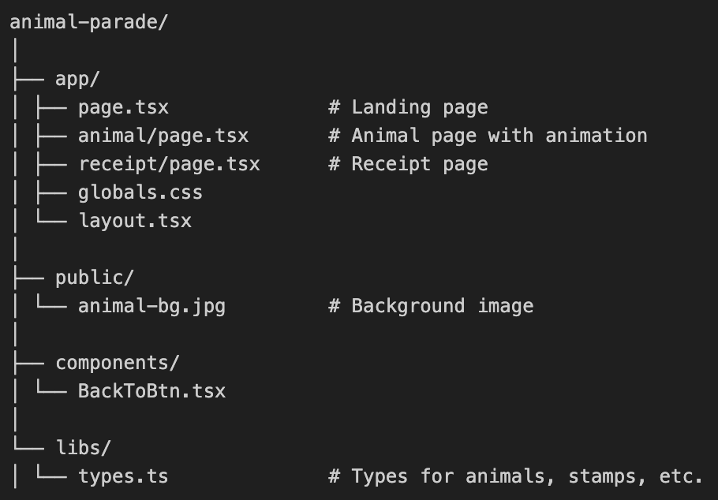

# Animal parade

A small, playful web-based amusement, part of Loopland amusement park (https://loopland.se). Built with Next.js and TypeScript.
When visitors choose "See an animal", a randomized animal appear. After the animation, the user receives a receipt with stamp, following Loopland's standards.

NOTE:
This amusement is built to be embedded inside Loopland via an <iframe>.
The navigation buttons are therefore designed to communicate back to Loopland when running inside that environment.
When visiting Animal Parade directly in a browser (outside the iframe), these buttons will not navigate to Loopland.
The only exception is the not-found page, which intentionally links to / as a fallback when the amusement is accessed standalone.

## Features

- Randomized animal selection with simple animation logic
- Clear flow: landing page -> animal page -> receipt page
- Responsive design styled with Tailwind CSS
- Fast routing using Next.js App Router
- Fully typed with TypeScript

## Project structure (simplified)

## Tech stack

- Next.js 14 (App Router)
- React 18
- TypeScript
- Tailwind CSS
- Vercel deployment

## Getting started

Install dependencies:
pnpm install

Run developkment server:
pnpm dev

Then open:
http://localhost:3000

## Deployment

Deployed on Vercel:
https://animal-parade-sand.vercel.app

## License

MIT License
